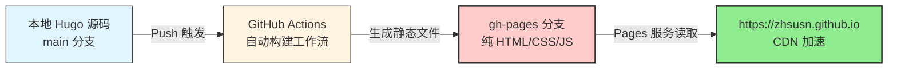

+++
title: "Hugo 静态博客 GitHub Pages 托管完整实施指南"
date: 2026-04-15T17:07:00+08:00
draft: false
tags: ["数字资产", "博客"]
categories: ["数字资产"]
description: "博客搭建详细步骤"
+++


## 一、技术架构与核心原则

### 1.1 架构概览（Vendored 模式）

本方案采用 **GitHub Actions 自动化构建 + gh-pages 分支托管** 的完全自动化部署架构，实现"本地编写 → Git 推送 → 自动构建 → 线上生效"的 DevOps 工作流。




### 1.2 核心设计原则


|原则|方案选择|技术考量|
|:--|:--|:--|
|**零外部依赖**|主题直接嵌入仓库（Vendored Mode）|避免 submodule 文件缺失、深度克隆失败、网络超时导致的构建不可复现|
|**构建自动化**|GitHub Actions 原生集成|利用 `GITHUB_TOKEN` 自动权限，无需额外密钥配置|
|**内容创作友好**|Obsidian 本地 + Hugo 渲染钩子|保留双链笔记习惯，通过渲染层自动转换 WikiLink 为标准 Markdown|
|**100% 可复现**|移除 Hugo Modules|避免国内网络环境下模块拉取超时，确保任意环境构建一致性|

---

## 二、前置条件与基础设施准备

### 2.1 开发环境要求

**必需工具安装（Windows 环境）：**


```powershell
# 使用 winget 进行包管理（无需额外安装包管理器）
winget install Hugo.Hugo.Extended
winget install Git.Git

# 版本验证（要求 v0.120.0+ 以支持现代渲染钩子）
hugo version
```

### 2.2 GitHub 仓库配置（关键步骤）

#### 仓库创建规范

访问 `https://github.com/new`，严格遵循以下命名规则：


|配置项|值|约束说明|
|:--|:--|:--|
|**Repository name**|`zhsusn.github.io`|**必须**与 GitHub 用户名完全一致，区分大小写|
|**Visibility**|`Public`|GitHub Pages 免费托管要求仓库公开|
|**Initialize with README**|❌ 不勾选|Hugo 自动生成首页，避免初始化冲突|

#### 权限预配置（一次性，部署前必须完成）

1. **Actions 工作流权限**  
    访问 `https://github.com/zhsusn/zhsusn.github.io/settings/actions`  
    设置：`Workflow permissions` → ✅ `Read and write permissions` → **Save**
    
2. **Pages 托管源配置**（首次构建后设置）  
    访问 `https://github.com/zhsusn/zhsusn.github.io/settings/pages`  
    设置：`Build and deployment` → `Source` → `Deploy from a branch`  
    指定分支：`gh-pages` / `(root)`
    

---

## 三、本地工程初始化

### 3.1 项目结构搭建


```powershell
# 创建项目工作目录
mkdir D:\data\blogs
cd D:\data\blogs

# 初始化 Hugo 站点与 Git 仓库
hugo new site .
git init

# 主题引入（Vendored 模式：直接克隆后移除 .git 历史）
git clone --depth=1 https://github.com/adityatelange/hugo-PaperMod.git themes/PaperMod

# 修复 PaperMod 主题已知缺陷（最新版缺失必要文件）
New-Item -ItemType File -Path "themes/PaperMod/layouts/partials/google_analytics.html" -Force
Set-Content -Path "themes/PaperMod/layouts/partials/google_analytics.html" -Value "{{- /* placeholder */ -}}"

# 关键步骤：删除主题内嵌 Git 历史，使其成为普通文件夹
Remove-Item -Recurse -Force themes/PaperMod/.git
```

### 3.2 站点基础配置（hugo.toml）

创建 `hugo.toml`（**编码要求：UTF-8 无 BOM**）：


```toml
baseURL = 'https://zhsusn.github.io'
languageCode = 'zh-CN'
title = 'zhsusn Tech Blog'
theme = 'PaperMod'

[params]
  author = 'zhsusn'
  defaultTheme = 'auto'
  ShowReadingTime = true
  ShowShareButtons = true
  # 增强：SEO 与社交媒体优化
  description = "技术架构与数据工程实践"
  keywords = ["大数据", "架构设计", "Hugo", "GitHub Pages"]
```

### 3.3 内容创建与本地验证


```powershell
# 创建内容目录结构
New-Item -ItemType Directory -Path "content/posts" -Force

# 生成首篇文章（自动创建 Front Matter）
hugo new content posts/hello.md

# 编辑文章：将 draft: true 改为 draft: false
notepad content/posts/hello.md
```

**Front Matter 示例：**


```markdown
---
title: "Hello World"
date: 2026-04-12T17:00:00+08:00
draft: false
tags: ["hugo", "github-pages"]
categories: ["技术基础设施"]
---

Hello, this is my first post!
```

**本地预览：**


```powershell
hugo server -D
# 访问 http://localhost:1313/ 验证渲染正常后，Ctrl+C 停止服务
```

---

## 四、CI/CD 自动化部署配置

### 4.1 GitHub Actions 工作流

创建 `.github/workflows/deploy.yml`（**复制即用，无需修改**）：


```yaml
name: Deploy to GitHub Pages

on:
  push:
    branches: [ main ]  # 监听主分支推送事件
  workflow_dispatch:    # 支持手动触发

jobs:
  deploy:
    runs-on: ubuntu-latest
    steps:
      - name: Checkout source code
        uses: actions/checkout@v4
      
      - name: Setup Hugo
        uses: peaceiris/actions-hugo@v2
        with:
          hugo-version: '0.160.1'
          extended: true  # 必需：支持 SCSS/SASS 处理
      
      - name: Build site
        run: hugo --minify --gc  # --gc 清理缓存，--minify 压缩资源
      
      - name: Deploy to gh-pages
        uses: peaceiris/actions-gh-pages@v3
        with:
          github_token: ${{ secrets.GITHUB_TOKEN }}  # 自动注入，无需配置
          publish_dir: ./public
          cname: ''  # 如需自定义域名，在此填写，如 'blog.zhsusn.com'
```

### 4.2 首次部署流程


```powershell
# 提交源码到主分支
git add .
git commit -m "init: vendored Hugo blog with PaperMod theme"
git remote add origin https://github.com/zhsusn/zhsusn.github.io.git
git branch -M main
git push -u origin main

# 备选：如遇企业防火墙限制，改用 SSH 协议
# git remote set-url origin git@github.com:zhsusn/zhsusn.github.io.git
```

**部署验证步骤：**

1. 访问仓库 `Actions` 标签页，确认工作流运行成功（绿色 ✓）
    
2. 等待 1-2 分钟，确认 `gh-pages` 分支已自动创建
    
3. 进入 `Settings` → `Pages`，确认 Source 指向 `gh-pages/(root)`
    
4. 访问 `https://zhsusn.github.io`，验证 PaperMod 主题首页渲染正常
    

---

## 五、内容创作与资产管理

### 5.1 标准发布工作流

日常发布仅需三步：


```powershell
cd D:\data\blogs

# 1. 创建文章（自动生成标准 Front Matter）
hugo new content posts/article-name.md

# 2. 编辑内容（修改 draft 状态，编写正文）
code content/posts/article-name.md  # 或 notepad/vim 等

# 3. 提交触发自动部署
git add .
git commit -m "add: article-name - 文章标题简述"
git push origin main

# 等待 1-2 分钟，线上自动更新（浏览器 Ctrl+F5 强制刷新）
```

### 5.2 Obsidian 集成与图片资产管理

为解决 Obsidian 双链笔记与 Hugo 标准 Markdown 的兼容性，实施以下分层处理策略：

#### Obsidian 本地配置（生产层）

**路径设置：**

- 设置 → 文件与链接 → **关闭「使用 Wiki 链接」**（强制标准 Markdown 语法）
    
- 设置 → 文件与链接 → 新笔记的存放位置 → `content/posts`
    
- 设置 → 文件与链接 → 附件默认存放路径 → `static/images`
    

**粘贴图片流程：**

- 截图/复制图片 → Obsidian 中粘贴（Ctrl+V）
    
- 图片自动复制至 `static/images/xxx.png`
    
- 自动生成标准语法：``
    

#### Hugo 渲染层增强（转换层）

创建 `layouts/_default/_markup/render-image.html`，实现路径智能解析：


```html
{{- $src := .Destination -}}
{{- $alt := .Text -}}
{{- $title := .Title -}}

{{/* 路径标准化处理 */}}
{{ $src = replaceRE "^/static/" "/" $src }}
{{ $src = replaceRE "^static/" "/" $src }}

{{/* 相对路径自动补全为绝对路径 */}}
{{ if not (strings.HasPrefix $src "/") }}
  {{ $src = printf "/images/%s" $src }}
{{ end }}


```

**转换逻辑说明：**

| Obsidian 输入                  | 渲染钩子输出                  | 最终 HTML                                |
| :--------------------------- | :---------------------- | :------------------------------------- |
| `![[architecture.png]]`      | `` | `` |
| `` | 清洗 `static/` 前缀         | ``          |
| ``       | 原样保留                    | ``          |

---

## 六、运维监控与故障排查

### 6.1 构建前验证清单


```bash
# 1. 检查 WikiLink 残留（阻塞性错误）
grep -r "!\[\[" content/ || echo "✓ WikiLink 语法检查通过"

# 2. 本地构建验证（模拟生产环境）
hugo --minify
ls -la public/images/  # 确认图片资源已正确复制

# 3. 链接完整性检查（可选安装：hugo mod get github.com/chrede88/hugo-check)
```

### 6.2 常见问题诊断速查表

表格

|故障现象|根因分析|解决方案|
|:--|:--|:--|
|**Actions 工作流失败（红色 X）**|PaperMod 主题缺失 `google_analytics.html`|创建空文件占位：见 3.1 节修复命令|
|**Actions 成功但站点 404**|Pages Source 设置为 "GitHub Actions" 而非 "Deploy from a branch"|进入 Settings → Pages，切换 Source 为 `gh-pages/(root)`|
|**hugo.toml 解析错误**|文件编码含 BOM 头或使用中文字符标点|记事本另存为 "UTF-8"，检查英文冒号/引号|
|**本地正常，线上样式 404**|`baseURL` 拼写错误或主题文件未提交|确认 `baseURL` 含 `https://`，执行 `git add themes/` 后重推|
|**推送超时/连接重置**|企业防火墙拦截 HTTPS 443|改用 SSH 协议：`git remote set-url origin git@github.com:zhsusn/zhsusn.github.io.git`|
|**图片线上不显示**|路径含 `static` 前缀或大小写不匹配|确认 5.2 节渲染钩子已提交，Linux 区分大小写|

### 6.3 长期维护建议

**缓存优化（可选增强）：**  
在 `.github/workflows/deploy.yml` 的 Setup Hugo 步骤前添加：


```yaml
- name: Cache Hugo resources
  uses: actions/cache@v4
  with:
    path: /tmp/hugo_cache
    key: ${{ runner.os }}-hugo-${{ hashFiles('go.sum') }}
```

**内容备份策略：**

- 源码层：Git 版本控制（main 分支）
    
- 发布层：gh-pages 分支自动生成（无需手动干预）
    
- 图片层：`static/images/` 随 Git 版本控制，或同步至对象存储（如阿里云 OSS）作为备份
    

---

## 七、附录：核心文件模板汇总

### A. 最小化 hugo.toml 配置


```toml
baseURL = 'https://zhsusn.github.io'
languageCode = 'zh-CN'
title = 'zhsusn Tech Blog'
theme = 'PaperMod'

[params]
  author = 'zhsusn'
  defaultTheme = 'auto'
  ShowReadingTime = true
```

### B. 标准文章 Front Matter


```yaml
---
title: "文章标题"
date: 2026-04-15T17:07:00+08:00
draft: false
tags: ["标签1", "标签2"]
categories: ["分类名"]
description: "文章摘要，用于 SEO 和列表展示"
---
```

### C. 网络超时备选方案（SSH 配置）


```powershell
# 生成 SSH 密钥对（如未配置）
ssh-keygen -t ed25519 -C "your@email.com"

# 添加公钥到 GitHub → Settings → SSH and GPG keys
# 修改远程 URL 为 SSH 协议
git remote set-url origin git@github.com:zhsusn/zhsusn.github.io.git

# 验证连接
ssh -T git@github.com
```

---

**文档特性总结：** 本方案采用 **Vendored 依赖管理** 与 **Render Hook 内容转换** 双重策略，在保证构建可复现性的同时，最大化保留原有 Obsidian 写作习惯。通过 GitHub Actions 原生集成，实现零服务器成本、零密钥配置的完全自动化内容发布管道。