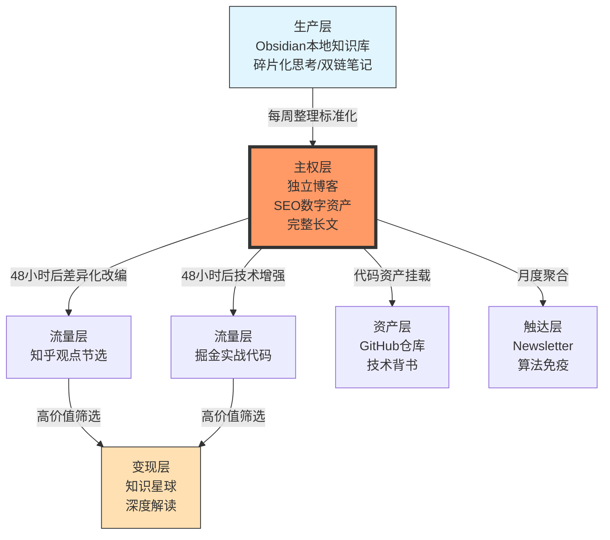

+++
date = '2026-04-15T15:11:05+08:00'
draft = false
title = '个人数字资产管理与品牌建设工程化方案'
+++

## 一、执行摘要（Executive Summary）

本方案构建以**独立博客为核心主权资产**的内容生态系统，通过"中心化存储、分布式触达、差异化呈现"的三层架构，实现技术影响力资产的长期积累与复合增值。

**核心机制**：

- **内容主权**：GitHub Pages + Hugo 构建完全可控的数字不动产
    
- **SEO护城河**：48小时原创保护期 + 规范化的跨平台分发策略
    
- **流量漏斗**：公域平台（知乎/掘金）→ 私域载体（Newsletter）→ 付费社群（知识星球）
    
- **零损耗工作流**：Obsidian 本地创作与 Git 版本控制的无缝集成
    

---

## 二、战略架构：三层防御体系与平台矩阵

### 2.1 架构设计原则




**关键约束**：

1. **单向流动原则**：禁止平台内容反向同步至博客，避免搜索引擎的重复内容惩罚（Duplicate Content Penalty）
    
2. **首发独占期**：博客发布后48小时内禁止跨平台分发，确保搜索引擎优先索引原创源并建立权威度（Authority）
    
3. **差异化变体**：各平台内容必须为"语义变体"（Semantic Variation），禁止全文复制导致的站内竞争（Cannibalization）
    

### 2.2 平台定位与边界矩阵


|层级|平台|核心定位|内容边界|更新频率|与主站关系|
|:-:|:--|:--|:--|:-:|:--|
|**主权层**|**独立博客**|数字不动产/SEO核心资产|完整闭环长文（3000+字）<br/>|**月更2-4篇**|唯一源头<br/>|
|**流量层**|**知乎**|中文搜索流量入口<br/>|节选改编（1500字）<br/>|**周更1-2篇**|≤博客发布频率<br/>|
|**流量层**|**掘金**|开发者社区渗透<br/>|实战教程（2000字）<br/>|**按需发布**|仅技术类文章配套发布<br/>|
|**资产层**|**GitHub**|技术实力背书<br/>|完整代码仓库<br/>|随博客更新|博客文章引用GitHub资源<br/>|
|**触达层**|**Newsletter**|算法免疫的直接触达<br/>|月度精选合集<br/>|**月更1期**|自动汇总本月博客精华<br/>|
|**变现层**|**知识星球**|私密深度交流<br/>|幕后解读/内部PPT<br/>|**周更3-5条**|筛选博客高互动话题<br/>|

---

## 三、内容运营方法论：全生命周期管理

### 3.1 内容生产流程（Content Pipeline）

**阶段一：生产层构思（Day 1-7）**

- **工具**：Obsidian 本地知识库，利用双链笔记建立知识网络
    
- **动作**：碎片化思考收集、资料剪藏、大纲构建
    
- **输出**：标准化 Markdown 格式的初稿（Front Matter 元数据完整）
    

**阶段二：主权层发布（Day 7）**

- **动作**：博客正式发布，确立内容主权（Content Sovereignty）
    
- **技术细节**：
    
    - 配置 `rel="canonical"` 标签指向博客原文
        
    - 生成结构化数据（Schema.org Article 标记）
        
    - 提交 Sitemap 至 Google Search Console
        

**阶段三：分布式改编（Day 9+）**

- **动作**：48小时后启动多平台改编分发
    

**阶段四：资产沉淀与变现（持续）**

- **动作**：高价值内容筛选至付费社群，月度 Newsletter 聚合
    

### 3.2 平台差异化改编规范

**知乎版改编策略**：

- **结构**：前1/3保留问题分析 → 中段插入争议观点 → 后段引导回流
    
- **SEO技巧**：标题植入疑问词（"为什么"、"如何"），前300字必须包含核心关键词
    
- **引流规范**：文末使用"阅读原文"锚文本链接，避免直接粘贴URL降低权重
    
- **示例模板**：
    
    
    ```markdown
    ## 为什么大多数公司的云原生监控都做错了？
    
    [问题分析段落...]
    
    ### 我的三个不同观点
    
    1. **误区一**：...
    
    > 完整版含架构图与Terraform配置：[阅读原文](https://yourname.github.io/posts/xxx)
    ```
    

**掘金版改编策略**：

- **结构**：删除理论阐述，保留"问题-代码-解决方案"三段式
    
- **增强要素**：
    
    - 可运行代码块（含注释与输出示例）
        
    - GitHub 仓库直链（具体文件路径）
        
    - 踩坑实录与性能测试数据
        
- **引流规范**：在代码注释中嵌入博客链接，而非正文突兀插入
    

**知识星球增值策略**：

- **内容增量**：必须提供博客未公开的**可执行情报**（Actionable Intelligence）
    
    - 内部架构评审PPT（脱敏）
        
    - 真实生产故障的完整时间线
        
    - 一对一技术答疑记录精选
        

### 3.3 内容类型与去向决策树


|内容类型|首发平台|二次分发|屏蔽平台|备注|
|:--|:--|:--|:--|:--|
|架构决策长文|博客（完整版）|知乎（观点节选）|掘金（如无代码）|强调决策逻辑与权衡|
|代码实战教程|博客（完整版）|掘金（代码增强版）|知乎（纯代码无观点）|配套GitHub仓库|
|行业趋势观察|博客（完整版）|知乎（争议切入）|掘金（无代码）|需结合个人实战经验|
|工具脚本/配置|GitHub（代码）|掘金（使用说明）|知乎（过于技术细节）|通过Gist分享代码片段|
|热点话题短评|知乎（独占首发）|高赞后整理为博客长文|Newsletter|快速响应，24小时内发布|

---

## 四、技术实施架构与工具链

### 4.1 核心技术栈选型


|组件|技术方案|选型逻辑|备选方案|
|:--|:--|:--|:--|
|**静态站点生成器**|Hugo (Go)|秒级构建速度、主题生态丰富（PaperMod）、原生Markdown支持|Jekyll（Ruby）、Next.js（React）|
|**托管基础设施**|GitHub Pages|免费、集成Git版本控制、Actions自动部署、自带CDN|Vercel、Netlify|
|**CDN加速**|Cloudflare Pages|双部署策略（冗余备份）、国内访问优化、DDoS防护|jsDelivr、又拍云|
|**本地写作环境**|Obsidian + Git插件|双链笔记、本地文件 sovereignty、30分钟自动备份|Typora + Git、VS Code + 插件|
|**图片资产管理**|GitHub + jsDelivr|图片主权统一、防外链失效、CDN加速|Cloudinary、自建图床|
|**邮件订阅**|Buttondown|RSS自动转邮件、1000订阅内免费、Markdown友好|Substack、Revue|

### 4.2 零干扰工作流（Zero-Friction Workflow）

基于**三层触发保存机制**的工程化实践：

**第一层：自动缓冲（Automatic Buffering）**


```plain
Obsidian 写作 → Obsidian Git 插件自动 commit（每30分钟或关闭时）
    ↓
文件自动同步到 GitHub 仓库（drafts 分支，不触发网站部署）
```

- **配置要点**：Obsidian Git 插件设置自动备份间隔，关闭应用时强制推送
    
- **分支策略**：`main` 分支为生产环境，`drafts` 分支为写作中稿件
    

**第二层：半自动发布（Semi-Automated Publishing）**


```bash
# 文章成熟后，手动标记发布
cd ~/Projects/blog
hugo new content posts/article-name.md  # 生成带模板的新文章
# 或手动将草稿从 drafts/ 移至 posts/
git add .
git commit -m "publish: 文章标题 - 简短描述"
git push origin main
# GitHub Actions 自动构建部署（无需人工干预）
```

**第三层：归档验证（Archival Verification）**

- **本地预览**：`hugo server -D` 实时渲染效果检查
    
- **线上验证**：`https://yourname.github.io` 检查构建产物
    
- **SEO检查**：使用浏览器开发者工具验证 meta 标签、canonical 链接
    

### 4.3 关键配置文件模板

**hugo.toml 核心配置**：


```toml
baseURL = 'https://yourname.github.io'
languageCode = 'zh-CN'
title = '你的技术品牌名'
theme = 'PaperMod'

[params]
  ShowReadingTime = true
  defaultTheme = 'auto'
  ShowShareButtons = true
  ShowPostNavLinks = true
  
  # SEO 增强
  [params.assets]
    disableHLJS = false
    favicon = "/favicon.ico"
    
  # 作者信息
  [params.author]
    name = "你的名字"
    email = "your.email@example.com"
```

**GitHub Actions 自动部署工作流**（`.github/workflows/deploy.yml`）：


```yaml
name: Deploy to GitHub Pages

on:
  push:
    branches: [ main ]

jobs:
  build-and-deploy:
    runs-on: ubuntu-latest
    steps:
      - uses: actions/checkout@v4
        with:
          submodules: true  # 获取主题子模块
          
      - name: Setup Hugo
        uses: peaceiris/actions-hugo@v2
        with:
          hugo-version: 'latest'
          extended: true
          
      - name: Build
        run: hugo --minify
        
      - name: Deploy
        uses: peaceiris/actions-gh-pages@v3
        with:
          github_token: ${{ secrets.GITHUB_TOKEN }}
          publish_dir: ./public
```

---

## 五、分阶段实施路线图（Roadmap）

### 阶段一：MVP验证期（第1周，零成本启动）

**目标**：建立最小可行工作流，发布首篇文章验证写作习惯与工具链


|步骤|关键动作|产出物|验收标准|
|:-:|:--|:--|:--|
|1|本地安装 Hugo 与 Git|本地构建环境|`hugo version` 命令正常输出|
|2|创建 GitHub 仓库 `username.github.io`|远程代码托管点|仓库可访问，README初始化|
|3|初始化 Hugo 项目并配置 PaperMod 主题|可本地运行的站点|`hugo server -D` 本地预览正常|
|4|配置 Obsidian Git 插件|自动备份工作流|关闭Obsidian时自动推送至GitHub|
|5|撰写并发布首篇博客|主权层首个数字资产|`username.github.io` 可公网访问|
|6|配置 GitHub Actions 自动部署|CI/CD流水线|push代码后5分钟内自动更新站点|

**推荐首篇文章主题**：AI编程六步法实践（基于已有积累，降低启动阻力）

### 阶段二：增长扩张期（第2-4月，积累10篇+长文）

**触发条件**：博客已稳定发布10篇长文，周更节奏确立


|新增模块|实施动作|预期收益|
|:--|:--|:--|
|**双部署容灾**|启用 Cloudflare Pages 导入 GitHub 仓库|国内访问加速，GitHub Pages故障时自动切换|
|**知乎渠道**|节选旧文改编，测试SEO引流效果|获取搜索引擎长尾流量|
|**Newsletter**|注册 Buttondown，连接 RSS 自动月更|建立算法免疫的读者触达通道|
|**内容结构化**|定义3-5个核心标签（如`架构决策`、`云原生`、`数据工程`）|建立内容分类体系，提升站内SEO|

### 阶段三：品牌变现期（第5-12月，验证商业可行性）

**触发条件**：月稳定访问量>5000，或需要商业合作/付费变现


|升级项|动作|技术要点|成本预算|
|:--|:--|:--|:-:|
|**自定义域名**|购买 `.dev` 或 `.com` 域名，修改 `baseURL`|配置 CNAME 记录，启用 HTTPS 强制跳转|￥60-100/年|
|**掘金渠道**|技术文章占比>50%时启动分发|代码片段优化，GitHub链接引流|免费|
|**SEO深度优化**|添加 Google Analytics 4、Microsoft Clarity、站点地图提交|配置 `robots.txt`，结构化数据标记|免费|
|**付费社群**|启动知识星球（已有100+忠实读者时）|建立内容筛选漏斗，博客→Newsletter→星球|平台抽成20%|

---

## 六、风险管控与合规指南

### 6.1 技术风险防控


|风险类型|错误做法|正确做法|技术原理|
|:--|:--|:--|:--|
|**SEO惩罚**|全文同步到多平台导致内容重复|博客首发48小时后，各平台必须**语义改编**|搜索引擎 Duplicate Content 过滤算法会降权重复页面|
|**平台限流**|使用自动化脚本批量发布到知乎|人工粘贴 + 调整前300字句式 + 添加平台专属内容|平台反垃圾算法会检测发布行为模式与文本指纹|
|**图片失效**|直接使用平台图床外链|图片统一存博客仓库 `/static/images`，通过 jsDelivr CDN 引用|防止第三方图床外链失效导致图片404|
|**域名锁定**|初期购买域名后发现内容方向不对|**零域名启动**：先用 `github.io` 验证3个月内容方向|域名迁移涉及SEO权重转移，成本较高|

### 6.2 内容合规与版权


|场景|合规要求|操作建议|
|:--|:--|:--|
|**代码版权**|公司内代码脱敏后才能公开|重写业务逻辑，保留技术模式；使用假数据示例|
|**图片版权**|避免使用无授权商业图片|使用 Draw.io 自绘架构图、Unsplash 免费图库、GitHub 渲染 Mermaid 图表|
|**平台规则**|遵守知乎/掘金社区规范|避免软广告嫌疑，技术内容>营销内容比例保持 9:1|

---

## 七、关键绩效指标（KPI）与效果评估

### 7.1 北极星指标（North Star Metric）

**内容资产总值** = 博客文章数 × 平均质量分 + GitHub Stars 数 × 0.5 + Newsletter 订阅数 × 2

### 7.2 分阶段衡量指标


|阶段|核心指标|目标值|监测工具|
|:--|:--|:-:|:--|
|**MVP期**|博客文章数|4篇/月|GitHub 提交记录|
||站点可用性|99.9%|UptimeRobot|
|**增长期**|自然搜索流量（Organic Traffic）|月增长30%|Google Analytics 4|
||知乎文章阅读量|单篇>1000|知乎创作者中心|
|**变现期**|Newsletter 订阅转化率|>2%|Buttondown 统计|
||知识星球付费转化率|订阅用户的5%|知识星球数据|

### 7.3 内容质量自评清单

每篇文章发布前自检：

- [ ] 是否解决了具体问题（Problem-Solution Fit）
    
- [ ] 是否包含原创观点（非简单搬运文档）
    
- [ ] 代码片段是否可运行（复制即用）
    
- [ ] 是否有清晰的结构化标题（H2/H3层级）
    
- [ ] 是否配置了正确的 Front Matter（标题/日期/标签/描述）
    

---

## 八、立即执行检查清单（Action Checklist）

### 今晚必须完成（30分钟）

- [ ] 安装 Hugo（`winget install Hugo.Hugo.Extended` 或 `brew install hugo`）
    
- [ ] 安装 Git 并配置用户名/邮箱
    
- [ ] 创建 GitHub 仓库 `yourname.github.io`（将 yourname 替换为你的 GitHub 用户名）
    
- [ ] 初始化 Hugo 项目：`hugo new site blog && cd blog`
    
- [ ] 添加 PaperMod 主题：`git init && git submodule add --depth=1 https://github.com/adityatelange/hugo-PaperMod.git themes/PaperMod`
    
- [ ] 复制基础配置到 `hugo.toml`（见4.3节模板）
    
- [ ] 创建首篇文章：`hugo new content posts/hello-world.md`
    
- [ ] 配置 Obsidian Git 插件（自动备份间隔设为30分钟）
    

### 本周完成（写作验证）

- [ ] 创建 Obsidian 与 Hugo 的 `content/posts` 目录软链接（Windows: `mklink /J`，Mac/Linux: `ln -s`）
    
- [ ] 撰写并发布3篇博客文章（验证写作节奏）
    
- [ ] 配置 GitHub Actions 自动部署（复制4.3节模板）
    
- [ ] 确认 `https://yourname.github.io` 可公网访问
    
- [ ] 创建知乎/掘金账号，准备改编模板
    

### 本月完成（流程固化）

- [ ] 积累4篇高质量博客文章
    
- [ ] 尝试首篇知乎改编（节选首篇博客测试效果）
    
- [ ] 配置 Cloudflare Pages 双部署（备用访问）
    
- [ ] 建立 Newsletter 邮件模板
    

### 季度评估（战略调整）

- [ ] 决定是否购买自定义域名（基于内容方向稳定性）
    
- [ ] 评估是否启动掘金分发（技术文章占比是否达标）
    
- [ ] 规划知识星球启动条件（粉丝基数/内容储备评估）
    

---

**附录：推荐首篇文章结构模板**

Markdown

复制

代码预览

````markdown
---
title: "文章标题：包含关键词"
date: 2026-04-15T10:00:00+08:00
draft: false
tags: ["架构", "云原生"]
description: "150字以内的摘要，用于SEO和社交媒体分享"
---

## 问题背景（Why）

描述你遇到的具体问题，建立共鸣。

## 解决方案（What & How）

详细的技术方案，包含：

### 架构设计

```mermaid
graph LR
    A[组件A] --> B[组件B]
````

### 核心代码

Python

复制

```python
# 可运行的代码示例
def solution():
    pass
```

## 踩坑记录（真实经验）

- **坑点1**：...
    
- **解决方案**：...
    

## 总结与展望

核心观点回顾，开放性问题引导评论。

---

_本文首发于[阿森](https://zhsusn.github.io/)，转载请注明出处。_